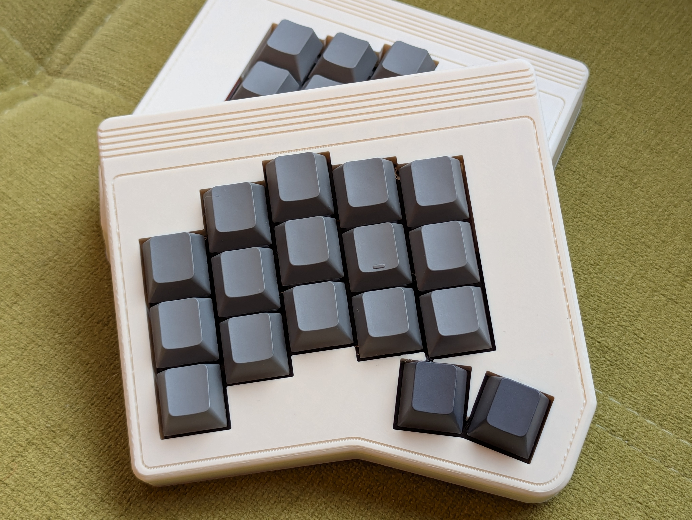
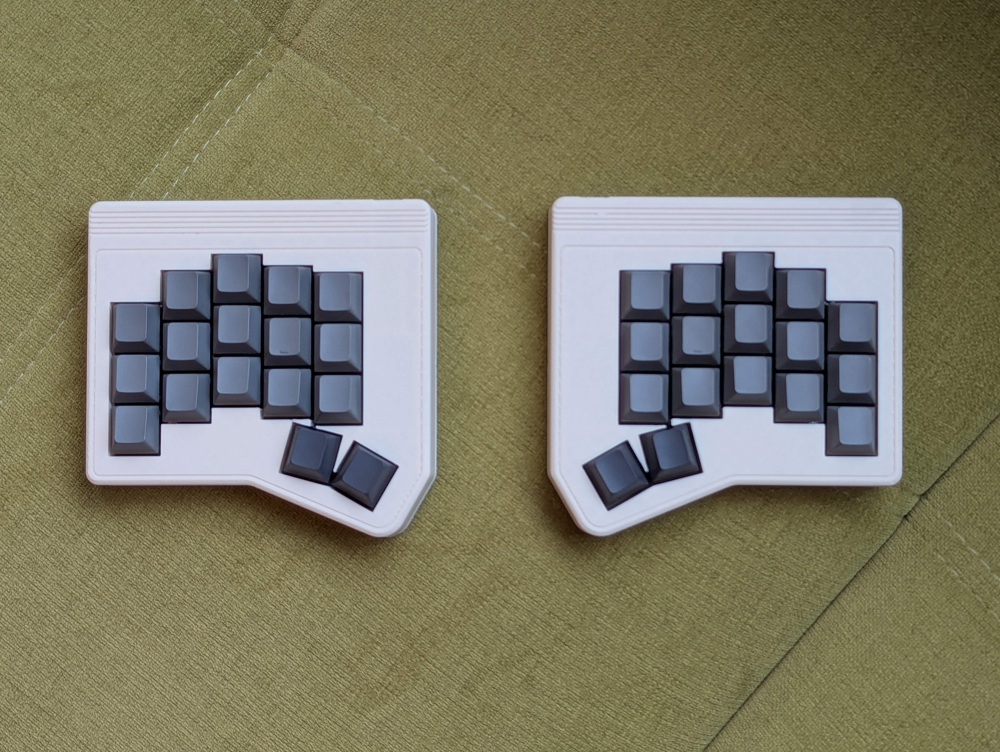
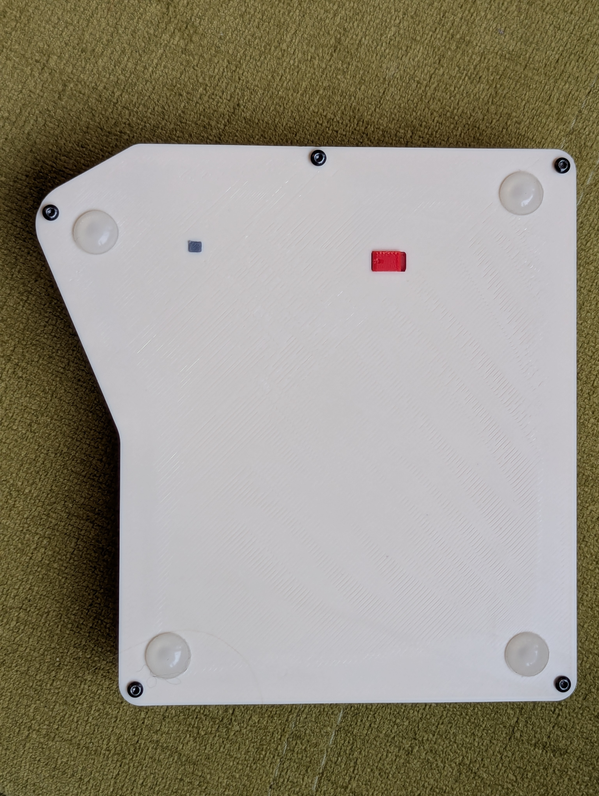
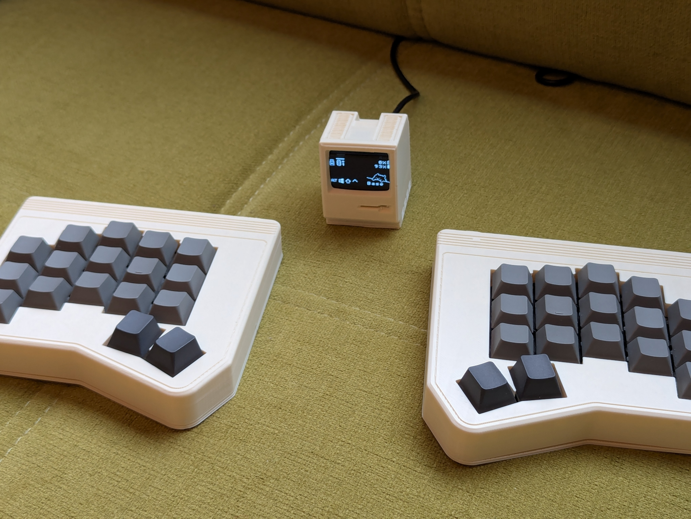
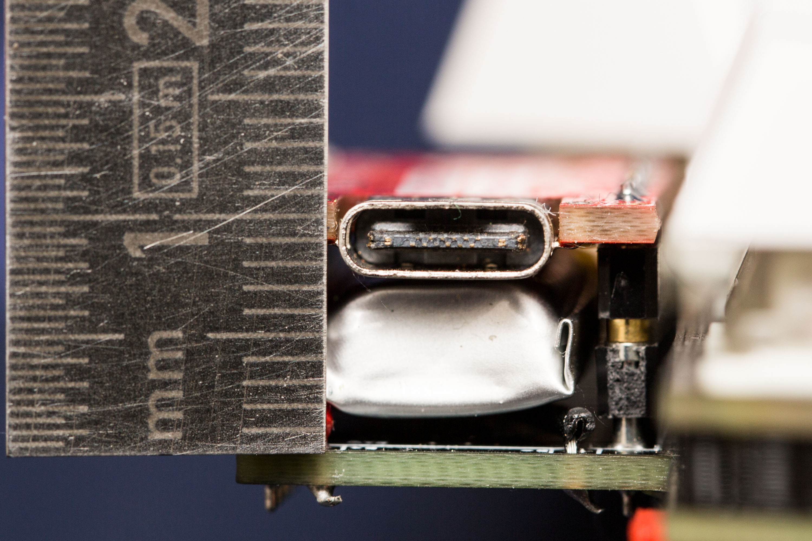

# Ferris-Sweep-MX-Commodore-Case
A customizable, 3D-print-friendly case designed in OpenSCAD – fully parametric for easy sizing, modification, and rapid prototyping.


**Features**

* **Fully enclosed, professional design** – clean look with no exposed internals
* **USB-C port access** – plug in without removing the case
* **Integrated controls** – built-in slider for power switch and reset button
* **Vibration-dampened** – TPU-printable switch plate and bottom damper for reduced noise
* **Easy PCB insertion** – no need to remove switches or keycaps
* **Secure bottom lid** – mounted with heat-set M2 threaded inserts
* **Refined acoustics** – quiet, pleasant typing sound
* **Configurable tentings** – adjustable tent angle for a more ergonomic hand position


|  |  |
|--------------------------|--------------------------|
|  |  |

---


# Getting Started

## Architecture Overview

The OpenSCAD code in `case/case.scad` follows a lightweight, modular structure:

- `extrude_layer(layer, z, h, delta)` is the primary helper; it pulls 2D contours from the `case/ferris_sweep_bling_mx.dxf` file (via the `import(..., layer=layer)` call) and turns them into 3D solids with optional offsets. Every major part—outer walls, switch plate, foam, decorations—starts from this DXF-driven extrusion, so keeping the DXF layers organized is critical.
- Higher level modules such as `top_case`, `bottom_case`, and accessories assemble features through boolean operations around those shared extrusions, ensuring consistent geometry between parts.
- The `build()` module is the entry point. It reads the `PART` variable (e.g., `"top_case"`, `"bottom_case"`, `"tent"`, or `"exploded"`) and conditionally renders the corresponding module. Setting `PART = "exploded"` produces a spaced stack to inspect clearances, while any other valid label renders just that component for export.

This separation lets you tweak parameters, update DXF layers, or introduce new modules without touching the common helper routines.

## 🧭 Adjusting the USB Outlet

The position of the USB-C port depends on your keyboard’s solder pin configuration and controller setup.  
Two parameters in `case.scad` define how the USB outlet aligns with your PCB:

### 1. `pcb_usb_distance`
- **Definition:** Distance (in millimeters) from the **PCB surface** to the **center of the USB-C port**.  
- **How to measure:**  
  Measure from the PCB’s top surface to the midpoint of the USB-C connector’s shell. In the example below, the distance is **9 mm**.  
- **Purpose:** Ensures the port opening in the case aligns precisely with the USB connector.

<p align="center">
  <br>
  <em>Example measurement — 9 mm from PCB to USB-C port center</em>
</p>

### 2. `controller_wall_thickness` *(optional)*
- **Definition:** Thickness of the **wall above the controller area**, directly over the USB port.  
- **Default:** Currently set to **1 mm** (`controller_wall_thickness = 1`).  
- **Adjustment:** Increase if the wall is too thin or if your controller sits deeper than expected.

### 🔧 To Adjust
1. Open `case.scad` in **OpenSCAD**.  
2. Find and edit the parameters:
   ```scad
   pcb_usb_distance = <your measured value>;         // e.g. 9
   controller_wall_thickness = <desired thickness>;  // e.g. 1.5
