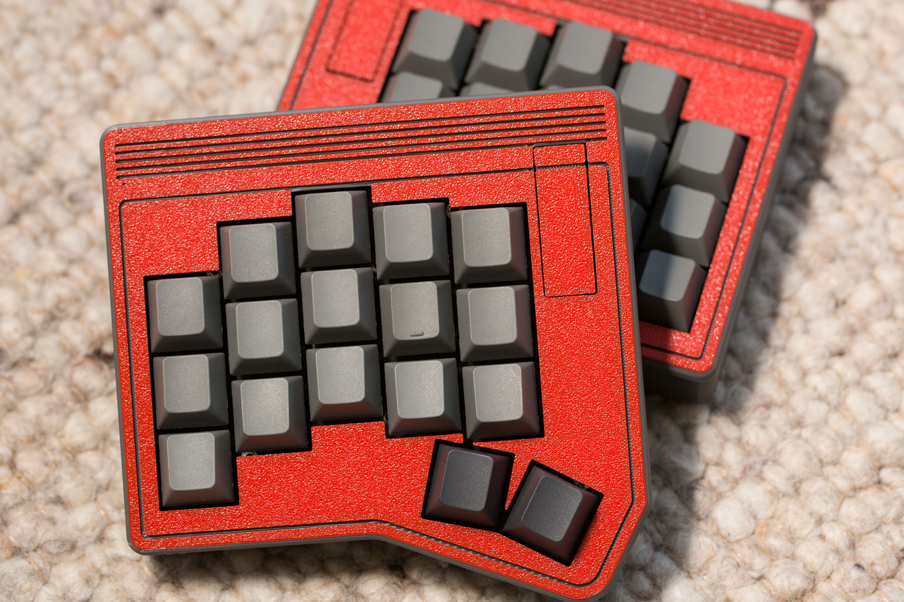
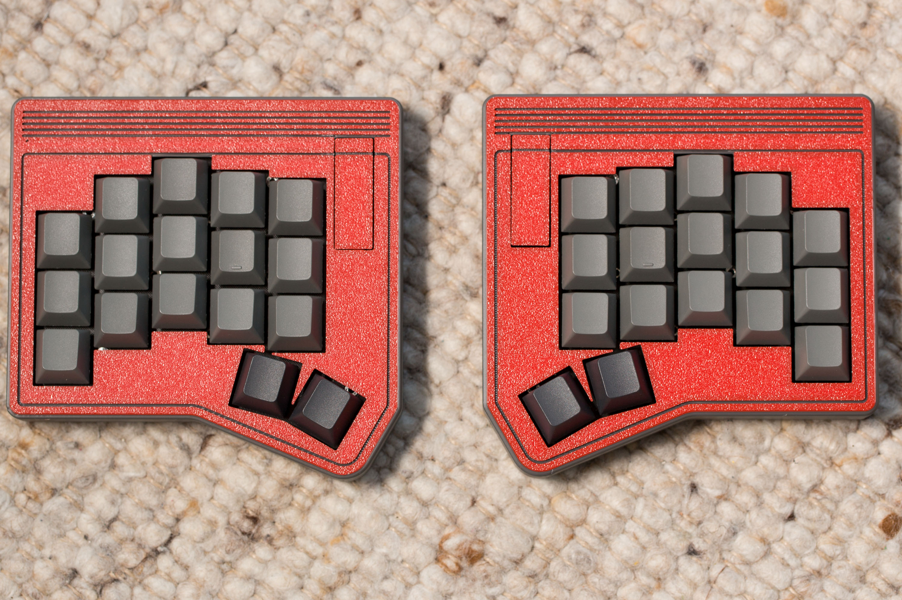
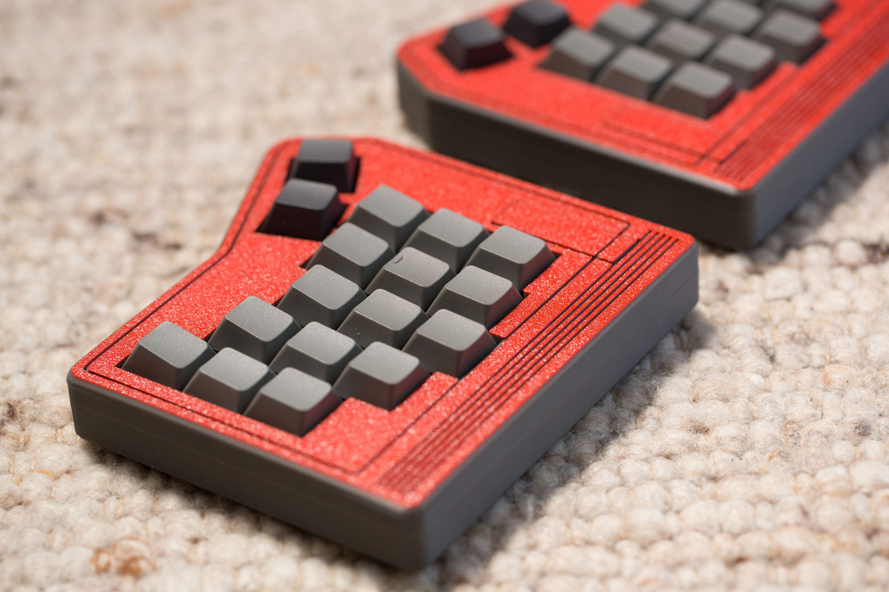
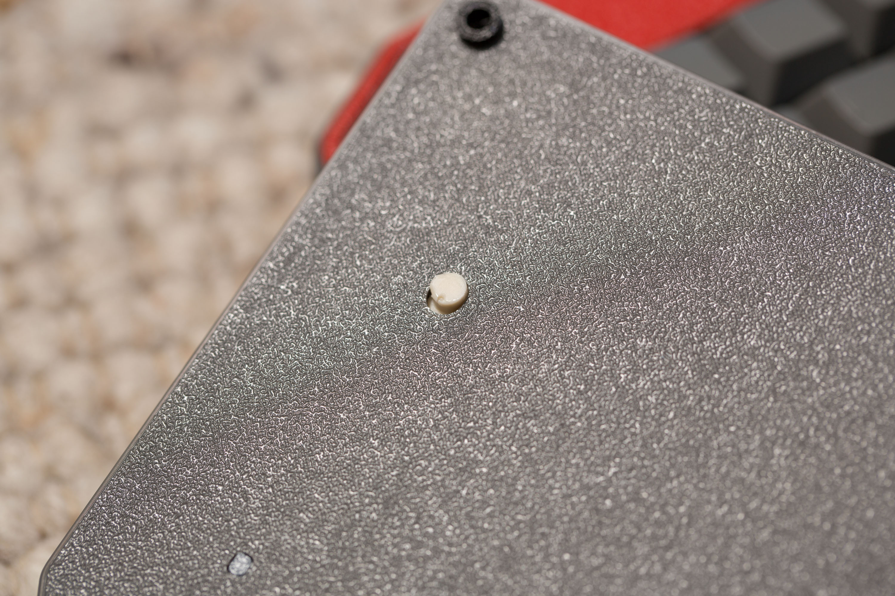
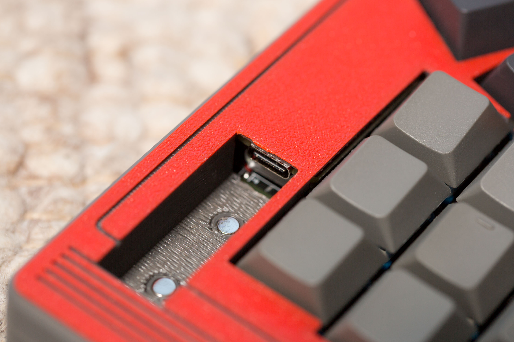
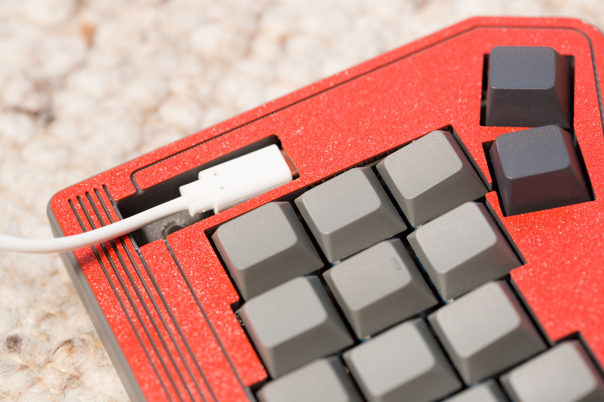
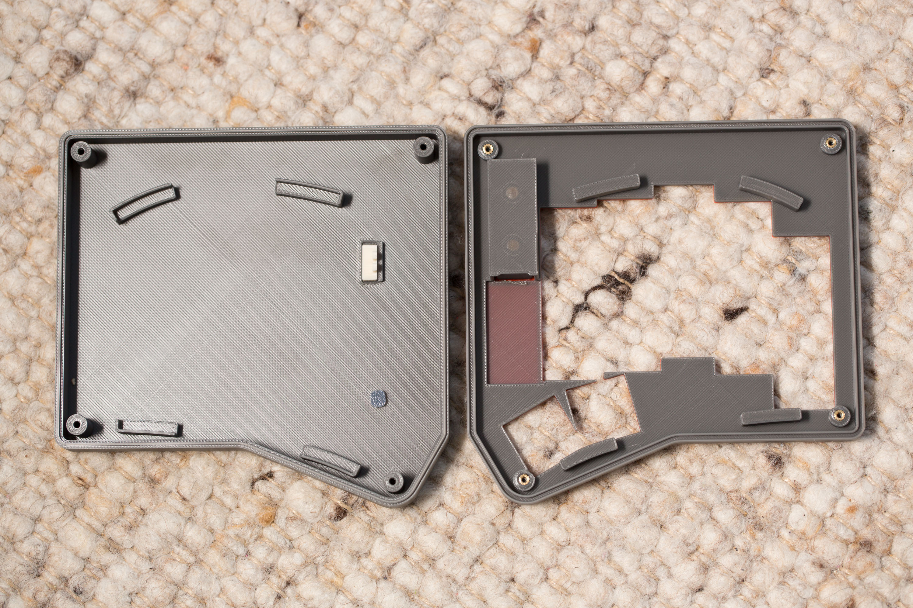
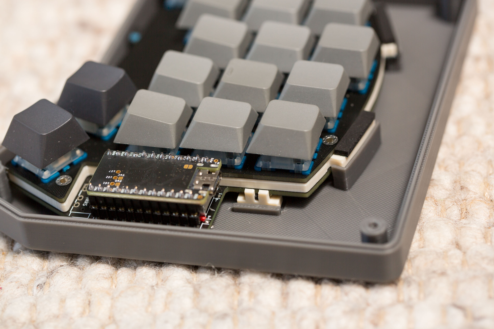
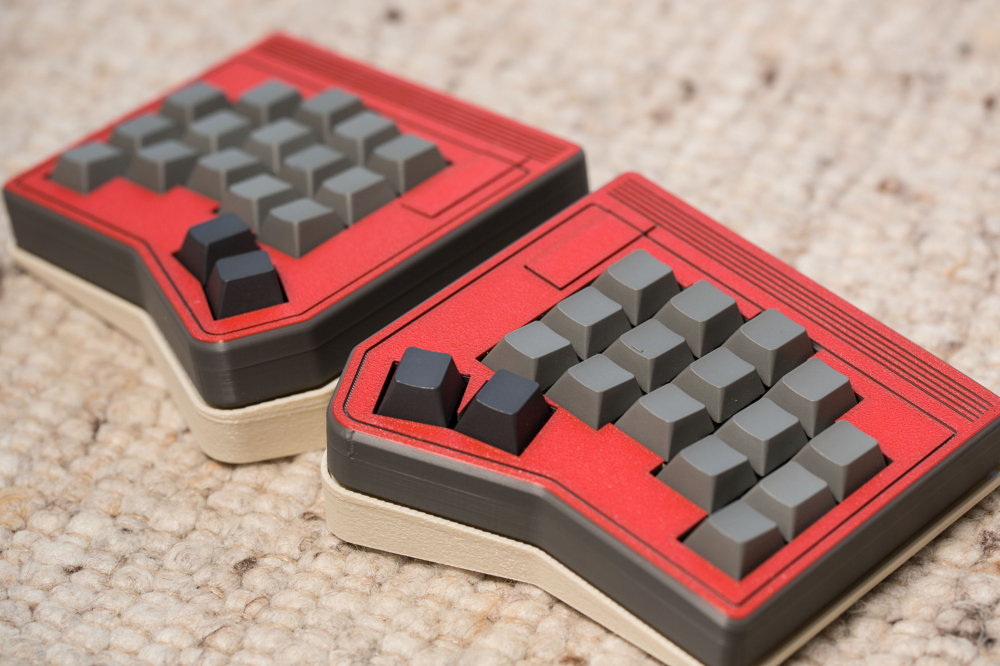
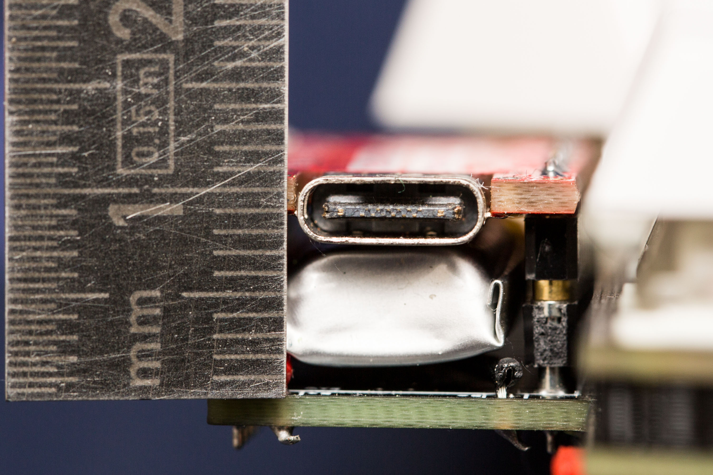

# Ferris Sweep MX Commodore Case

Custom gasket-mount style case for the Ferris Sweep Bling MX.

## Table of Contents

- [Overview](#overview)
- [Gallery](#gallery)
- [What Changed in v2](#what-changed-in-v2)
- [Repository Structure](#repository-structure)
- [Quick Start](#quick-start)
  - [PART Output Matrix](#part-output-matrix)
- [Architecture Overview](#architecture-overview)
  - [DXF Layer Contract](#dxf-layer-contract)
- [Bill of Materials (BOM)](#bill-of-materials-bom)
- [Print Guidance](#print-guidance)
- [Key Parameters](#key-parameters)
  - [USB Outlet Alignment](#usb-outlet-alignment)
  - [pcb_usb_distance](#pcb_usb_distance)
  - [controller_cover_thickness (optional)](#controller_cover_thickness-optional)
  - [Gasket Setup](#gasket-setup)
  - [Heat Inserts and Screws](#heat-inserts-and-screws)
  - [USB Outlet Cover Retention](#usb-outlet-cover-retention)
- [Acoustics](#acoustics)
- [CI / Automation](#ci--automation)
- [License](#license)

## Overview

The design was inspired by a Reddit post that showed a gasket mount style case for the Ferris Sweep Bling MX. No STL files were published, so this repository contains my own implementation.

Primary focus:

- Protection with an enclosed case
- Access to power switch, reset button, and USB port
- Gasket mount style isolation
- Improved typing acoustics

## Gallery

| | |
|---------------|----------------|
|  |   |
|   |   |
|   |   |
|   |   |

|   | 

## What Changed in v2

- Introduced gasket mount style
- Improved structural rigidity
- Better acoustic behavior

## Repository Structure

- `case/case.scad`: Main OpenSCAD generator
- `case/ferris_sweep_bling_mx.dxf`: Source 2D layers used for all major extrusions
- `gallery/`: Build and fit photos

## Quick Start

1. Open `case/case.scad` in OpenSCAD.
2. Set `PART` to the part you want to export (`top_case`, `bottom_case`, `switch_plate_foam`, etc.).
3. Render with `F6`.
4. Export STL.

Use `PART = "exploded"` to inspect clearances and stack order before final export. You can also set `EXPLODE = 0` to inspect the assembled geometry while still using exploded build logic.

### PART Output Matrix

| `PART` value | STL export | Required for build | Purpose |
|--------------|------------|--------------------|---------|
| `top_case` | `top_case.stl` | Yes | Top shell with keycap and controller cutouts |
| `bottom_case` | `bottom_case.stl` | Yes | Bottom shell with supports and screw structures |
| `switch_plate_foam` | `switch_plate_foam.stl` | Yes | Plate/foam interface layer |
| `power_switch_slider` | `power_switch_slider.stl` | Yes | External power slider part |
| `reset_switch_button` | `reset_switch_button.stl` | Yes | External reset button part |
| `usb_plug_cover` | `usb_plug_cover.stl` | Optional | Removable USB outlet cover |
| `rubber_feet` | `rubber_feet.stl` | Optional | Optional printed feet inserts |
| `tent` | `tent.stl` | Optional | Optional tenting support |
| `exploded` | *(view only)* | No | Visual assembly / clearance inspection |

## Architecture Overview

The OpenSCAD code in `case/case.scad` follows a lightweight modular structure:

- `extrude_layer(layer, z, h, delta)` is the primary helper. It imports a DXF layer and extrudes it with optional offset.
- Higher-level modules such as `top_case`, `bottom_case`, and accessories build geometry through boolean operations around shared extrusions.
- `build()` is the entry point. It reads `PART` and renders the selected component.

This separation makes it easy to tune parameters, update DXF layers, or add modules without changing core helper routines.

### DXF Layer Contract

The following DXF layers are expected by `case/case.scad`. Renaming or removing layers will break matching modules.

| Layer name | Purpose |
|------------|---------|
| `pcb_outline` | PCB and internal clearance envelope |
| `outer_shape` | Main outside perimeter |
| `outer_shape_decor` | Top decorative area cutout |
| `decor_lines` | Decorative line engraving/cutout |
| `keycaps_outline` | Keycap clearance opening |
| `controller_cutout` | Controller/USB area opening |
| `reset` | Reset button geometry |
| `pwr_lid_cutout` | Power slider top cutout |
| `pwr_body` | Power slider body |
| `pwr_circ` | Power slider cap/circle |
| `pwr_body_support` | Internal support under power area |
| `pwr_knob_cutout` | Slider knob relief |
| `pwr_body_overhang` | Slider overhang guidance |
| `pwr_overhang_cutout` | Overhang clearance cutout |
| `pwr_on_label` | Optional ON marking |
| `switches` | Switch opening references |
| `switchplate_outline` | Switchplate foam outline |
| `gasket_supports` | Gasket support contact areas |
| `gasket_supports_rim` | Gasket rim geometry |
| `screw_markers` | Screw/insert marker positions |
| `usb_plug_cutout` | USB cover body cutout |
| `usb_plug_decor` | Optional USB cover decorative cutout |
| `usb_plug_magnets` | USB cover magnet pockets |

## Bill of Materials (BOM)

Quantity notation:

- **Per half** = one keyboard half
- **Total pair** = full split keyboard (two halves)

| Item | Spec used | Per half | Total pair |
|------|-----------|----------|------------|
| Heat-set inserts | M2 x 3 x 3.5 | same as screw marker count | 2x per-half count |
| Screws | M2 hex, 4 mm length | same as screw marker count | 2x per-half count |
| USB cover magnets | 4 mm x 1 mm | 2 | 4 |
| Gasket strips | Poron, 2 mm | as required by gasket path | 2x per-half amount |

Notes:

- Heat-set inserts are required for this design.
- Tested insert install temperature in PETG: **190°C**.
- If you use different inserts or screws, adjust the matching parameters in `case/case.scad`.

## Print Guidance

Baseline used for successful builds:

- Material: PETG
- Infill: 40% gyroid
- Supports used: screw hole support areas and the USB cutout region

Recommended starting approach:

- Print each `PART` in its natural flat orientation from OpenSCAD export.
- Supports were used specifically at screw hole support areas and the USB cutout; keep supports targeted to those regions.
- Keep wall/perimeter settings consistent across top and bottom shells for even seam behavior.

## Key Parameters

### USB Outlet Alignment

The position of the USB-C port depends on your solder-pin configuration and controller setup.

#### `pcb_usb_distance`

- Definition: Distance (mm) from PCB surface to USB-C port center
- Purpose: Aligns the USB opening with your connector

<p align="center">
  <br>
  <em>Caption: Measuring PCB-to-USB-C center distance (example value: 9 mm)</em>
</p>

#### `controller_cover_thickness` (optional)

- Definition: Wall thickness above the controller area near the USB outlet
- Default: `1` mm
- Adjustment: Increase if your controller sits deeper or if that wall is too thin

Adjust in `case.scad`:

```scad
pcb_usb_distance = <your measured value>;          // e.g. 9
controller_cover_thickness = <desired thickness>;  // e.g. 1.5
```

Then render (`F6`) and verify alignment before exporting STLs.

### Gasket Setup

The case is designed for Poron gasket strips and uses a compression model.

- Material used: 2 mm Poron foam strips
- Target compression: 60%
- Configured by:

```scad
gasket_thickness = 2;
compression = 0.6;
compressed_gasket_thickness = gasket_thickness * (1 - compression);
```

Adjustable:

- `gasket_thickness`: Match your actual foam thickness
- `compression`: Tune feel and preload

Do not adjust:

- `switch_plate_foam_thickness` should remain fixed. It represents the physical distance between PCB and switch plate defined by the MX switch stack-up.

### Heat Inserts and Screws

Heat-set inserts are required and are installed in the **top shell**.

Reference hardware used for this build:

- Insert: **M2 x 3 x 3.5**
- Screw: **M2 hex, 4 mm thread length**
- Tested insert install temperature in PETG: **190°C**

Install guidance:

- Heat the insert tool, align the insert perpendicular to the hole, and press in slowly.
- Stop when the insert is flush with the pocket surface (avoid over-driving).
- Let the area cool fully before test-fitting screws.

If you use different inserts or screws, tune these parameters in `case/case.scad`:

- `heat_sink_insert_diameter`: Insert outer diameter fit
- `heat_sink_insert_depth`: Insert pocket depth
- `screw_diameter`: Clearance for screw threads
- `head_diameter`: Clearance for screw head
- `thread_length`: Effective screw engagement length
- `thread_intrusion`: How far screw threads extend into the structure
- `screw_support_diameter`: Diameter of local support around screw locations

### USB Outlet Cover Retention

The USB outlet cover is held in place with magnets.

- Magnet size: **4 mm x 1 mm**
- Quantity used: **2 magnets per case half**
- Mounting method used: **glued in place**

## Acoustics

This case is tuned for a muted, less hollow sound profile through gasket isolation and enclosure rigidity.

Baseline used:

- Infill: 40% gyroid
- Gasket: 2 mm Poron strips
- Compression target: 60%

Why this works:

- Gasket isolation reduces direct transfer of high-frequency vibration into the shell
- 40% gyroid infill improves structural consistency and lowers resonance versus low infill
- Enclosed geometry and wall thickness add mass and reduce hollowness

Tuning notes:

- If sound is too sharp: increase `compression` slightly or use softer gasket foam
- If feel is too soft/over-damped: reduce `compression` slightly
- Keep `switch_plate_foam_thickness` unchanged

## CI / Automation

- Build STLs on push: Renders all STL parts on push/PR/manual run and uploads a consolidated `case` artifact
- Build and Release STLs: Runs on tags (`v*`), builds all parts, bundles `case.zip`, and publishes a GitHub Release

## License

See `LICENSE`.


